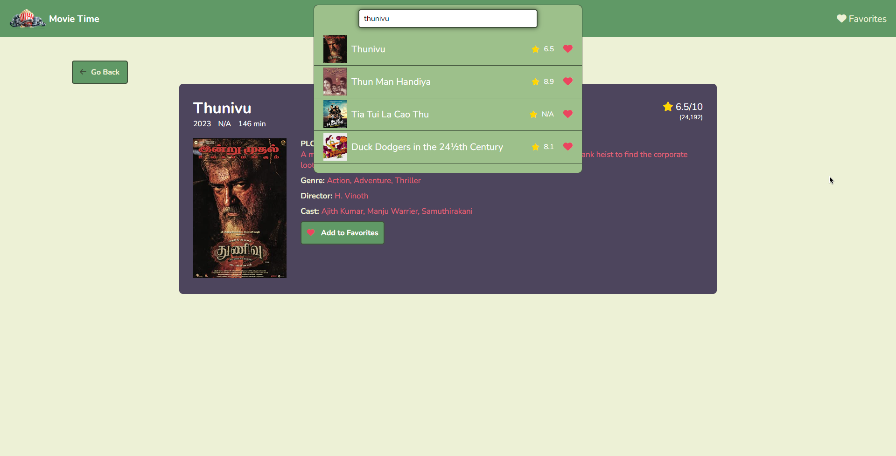
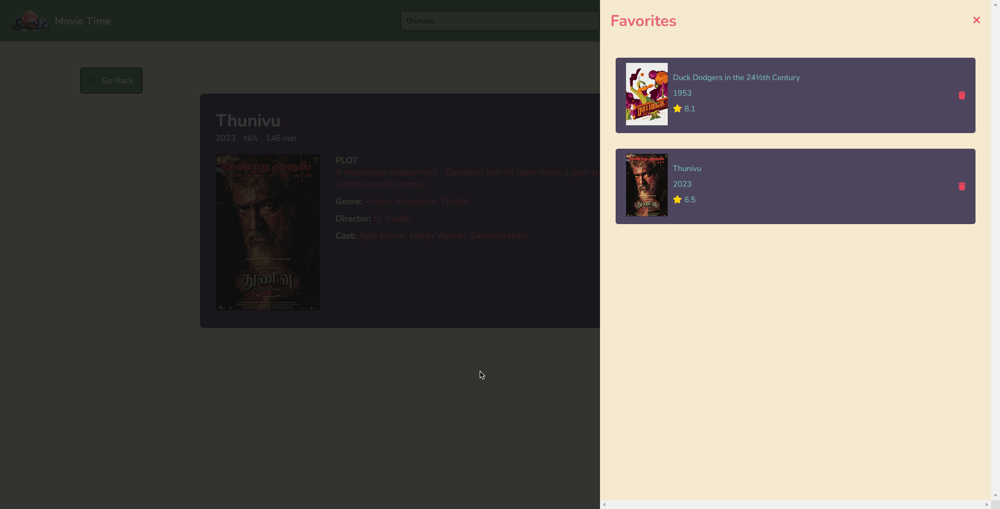

This is a imdbClone App.

- Live Site URL: [https://acgeoffrey.github.io/imdbClone/]

## Table of contents

- [Features](#features)
- [Screenshot](#screenshot)
- [Built with](#built-with)
- [Author](#author)

### Features
  - Home Page
    - Searches any movie from the imdb via API and displays the search results on the frontend while typing.
  - Movie Page
    - Shows the information about the movie.
  - Favorites
    - Display a list of all the favorite movies.
    - List is persistent(LocalStorage) and won't destroy even if the   browser if restarted or reloaded.

### Screenshot

### Built with

- HTML5 markup
- CSS
- JavaScript

## Author

Geoffrey